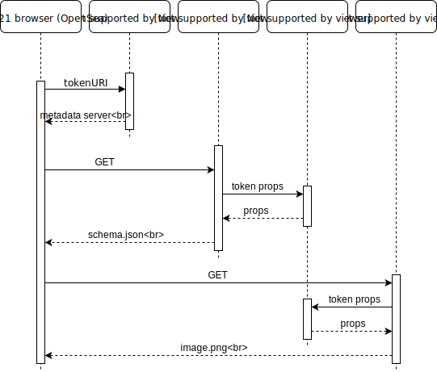

# crypto-soccer-metadata-server
Return a JSON description generated from the token (player/team) id.



Endpoints:
* /players/\<ID>
* /teams/\<ID>
  
# install & run
``` 
$ npm install
$ npm start
```

# config.json
```
{
    "provider": "ws://127.0.0.1:8545", // ex. Ganache
    "crypto_player_address": "0x73E02FefD1d31607b8d5c9Ee9F0c465033C1ebf3", 
    "players_image_base_URL": "https://www.freenode.io/players/image/"
}
```

# ERC721 Metadata JSON Schema 
```
{
    "title": "Asset Metadata",
    "type": "object",
    "properties": {
        "name": {
            "type": "string",
            "description": "Identifies the asset to which this NFT represents"
        },
        "description": {
            "type": "string",
            "description": "Describes the asset to which this NFT represents"
        },
        "image": {
            "type": "string",
            "description": "A URI pointing to a resource with mime type image/* representing the asset to which this NFT represents. Consider making any images at a width between 320 and 1080 pixels and aspect ratio between 1.91:1 and 4:5 inclusive."
        }
    }
}
```

# [OpenSea extended Metadata JSON Schema](https://docs.opensea.io/docs/2-adding-metadata)
```
{
  "attributes": [
    {
      "trait_type": "base", 
      "value": "narwhal"
    }, 
    {
      "trait_type": "eyes", 
      "value": "sleepy"
    }, 
    {
      "trait_type": "mouth", 
      "value": "cute"
    }, 
    {
      "trait_type": "level", 
      "value": 4
    }, 
    {
      "trait_type": "stamina", 
      "value": 90.2
    }, 
    {
      "trait_type": "personality", 
      "value": "boring"
    }, 
    {
      "display_type": "boost_number", 
      "trait_type": "aqua_power", 
      "value": 10
    }, 
    {
      "display_type": "boost_percentage", 
      "trait_type": "stamina_increase", 
      "value": 5
    }, 
    {
      "display_type": "number", 
      "trait_type": "generation", 
      "value": 1
    }
  ], 
  "description": "Friendly OpenSea Creature that enjoys long swims in the ocean.", 
  "external_url": "https://openseacreatures.io/3", 
  "image": "https://storage.googleapis.com/opensea-prod.appspot.com/creature/3.png", 
  "name": "Dave Starbelly"
}
```

